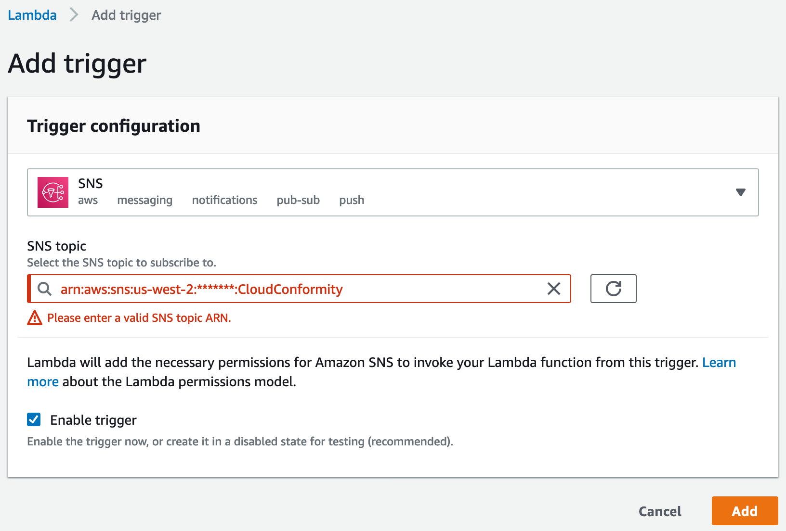
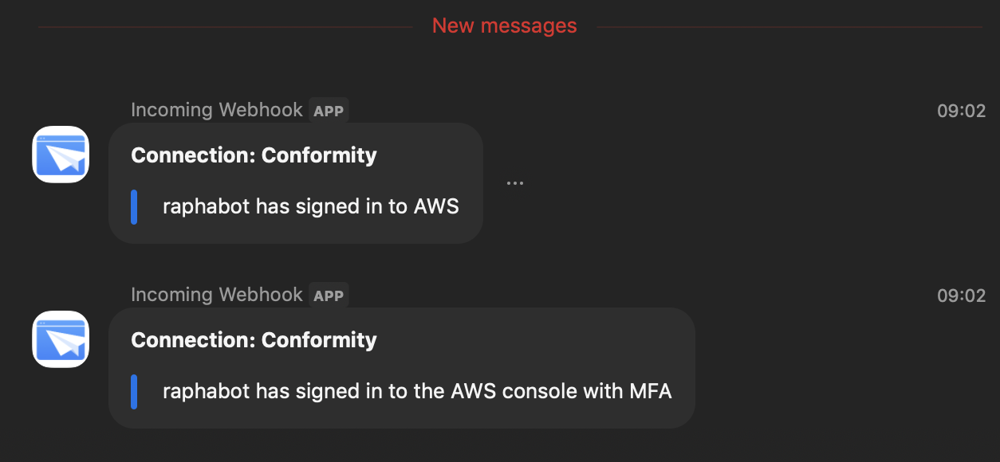

# SNS to Zoom

This project was created with the purpose of pushing information from Conformity to Zoom via SNS, but should work with any data on a SNS topic that you might want to publish to Zoom.

## How to use

First, we need to update the *src/index.ts* two first lines with your Zoom URL and Token. To do so, you'll need to configure your Zoom *Incoming Webhook*. More info [here](https://zoomappdocs.docs.stoplight.io/incoming-webhook-chatbot).

Create a new Lambda (I called it *sns-to-zoom*) and set its runtime to *Node.js 12.x*.

Have the trigger for this lambda to be your existing SNS topic.

Make any updates do package.json deploy command if you need to change the deployment region or function name.

Run ``npm run deploy``.

### Example

